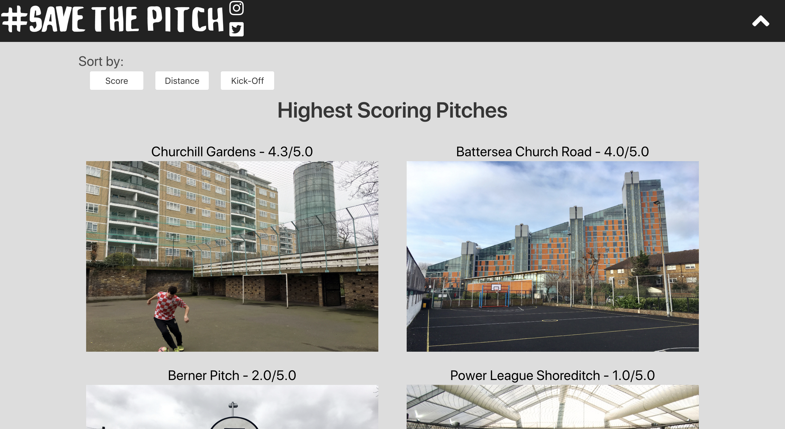
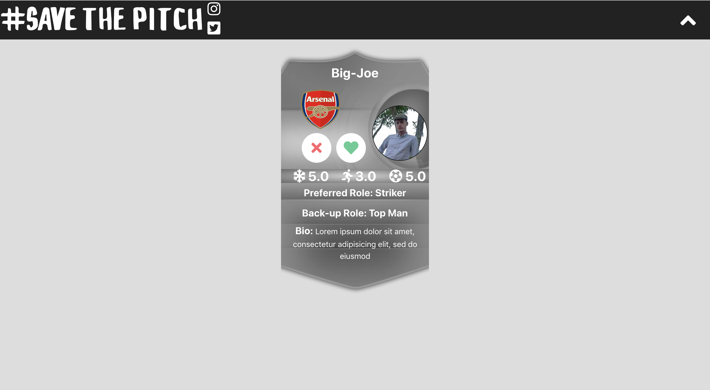
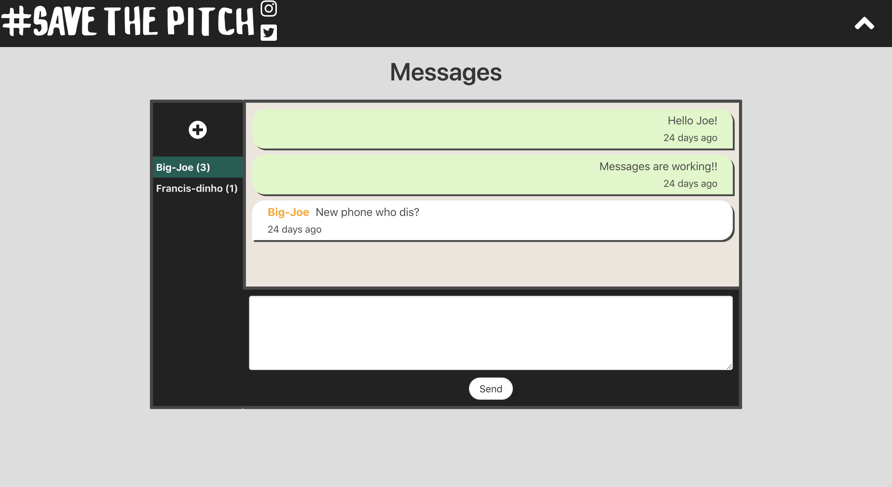
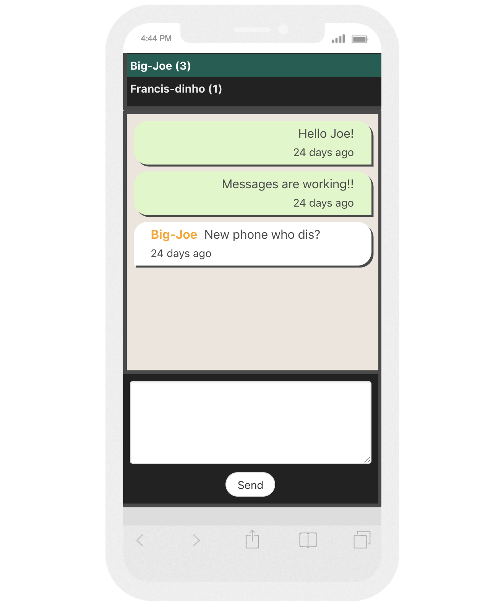

# General Assembly WDI Project 4: Save The Pitch

[GitHub](https://github.com/fwgbell/wdi-project-four)

[Heroku Link](https://save-the-pitch.herokuapp.com/)

The aim with Save the Pitch was to create an app that would get young people away from their screens and out onto the pitches, playgrounds and cages of inner city London. At their best, these shrines to the beautiful game are electric with energy, passion and fun; players learn and grow and lifelong friendships are made. At their worst, they are underused, fall into disrepair, and become car parks, building sites and dumping grounds. They can seem threatening, where disenfranchised youth go to hang out and cause mischief. It doesn’t have to be this way – Through mapping and photographing these pitches I aimed to open them up to new players and make them inviting, attractive and accessible. I hoped to show parents that they are safe and good for their kids and use technology to get people out there to join games and kick-abouts.

The application was made using an Express back-end and React front-end using several node modules such as leaflet and moment, to make the most of mapping and timings respectively. This was the first time I’d worked with maps and distances on a project and it was a really difficult challenge to begin with but I’m pleased with how I was able to implement them in the end and I think they really add a lot of utility to the app.

The part I’m most proud of is the messaging section of the app. Being able to message your friends in real-time back and forth made the app feel more real.


___

## Screenshot Walk-through

### Home page


### The pitch index page. This can be sorted by closest to you, average review rating or next to have an event taking place.



### This map page can be used to see near pitches to your current location


### Find page. This is the page for finding players to connect with and message.



### This is a user's profile page. It displays their information and upcoming fixtures. The background is and colour scheme is determined by the club the user supports.


### Messaging page. This page is where users can message back and forth to arrange or discuss pitches and matches



### This is how the messaging page looks on mobile



---

## Brief

* Build a full-stack application by making your own backend and your own front-end
* Use an Express API to serve your data from a Mongo database
* Consume your API with a separate front-end built with React
* Be a complete product which most likely means multiple relationships and CRUD functionality for at least a couple of models
* Implement thoughtful user stories that are significant enough to help you know which features are core MVP and which you can cut
* Have a visually impressive design to kick your portfolio up a notch.
* Be deployed online so it's publicly accessible.
* Have automated tests for at least one RESTful resource on the back-end.


---

## Technologies Used:

* HTML5
* SCSS
* JavaScript (ECMAScript 6)
* React.js
* Node.js
* MongoDB
* Mocha
* Chai
* Git
* GitHub
* Heroku
* Trello
* Fontawesome

___

## Approach Taken

### Functionality

For this project I set myself quite a simple minimum viable product, a pitch data base where users could login, upload and review football pitches. While planning I then came up with many more features that I could work on implementing to improve the app once I had reached this M.V.P., such as the match hosting features and review system. This made my use of the short amount of time we had very efficient and I was able to add a lot of functionality to the app to make it very feature rich.

#### Featured piece of code 1

This is a function from my find players section of the app. It's very similar to how Tinder matches users. The user is shown other users profiles and can like or dislike them. If the current user likes a profile of another user that has liked them back then the two users are "matched" and connected in the messenger section of the app.

The start of the if block below checks to see if the currently viewed profile contains the currently logged in user's ID in it's likes array. If this is truthy then the two users like each other and it's a match. Axios is then used to make a post request to my likedEachother route in the backend which will pair the users in the messenger. The currently viewed profile is set to match on state to create a pop-up on screen asking the user if they'd like to message them now or keep on finding players.

In the else part of the function it is not a match so the like is posted to the back end to be saved to the database but a match is not displayed and the users aren't connected in the messenger.

``` JavaScript
like(){
  console.log('liked!', this.state.profile);
  if(this.state.profile.likes.includes(decodeToken().sub)){
    const sendObject = {
      _id: this.state.profile._id
    };
    axios.post('/api/likedEachother', sendObject, authorizationHeader())
      .then(result => this.setState({ match: this.state.profile, liked: sendObject._id, users: result.data }, this.sortUsers));
  } else{
    const sendObject = {
      _id: this.state.profile._id
    };
    axios.post('/api/like', sendObject, authorizationHeader())
      .then(result => this.setState({ liked: sendObject._id, users: result.data }, this.sortUsers));
  }
}
```

This is the route in the backend which will connect users who have matched with each other by creating a match message between them. As well as saving the request body in the likes array of the current user.

``` JavaScript
function matchProfile(req, res, next){
  const matchMessage = {
    from: req.currentUser._id,
    to: req.body._id,
    content: 'You two are a match!!',
    matchMessage: true
  };
  User
    .findById(req.currentUser._id)
    .then(user => {
      user.likes.push(req.body);
      return user.save();
    })
    .then(Message.create(matchMessage)
      .then(User
        .find()
        .then(users => res.json(users)))
    )
    .catch(next);
}
```

### Styling

At this point in production I had only done minimal styling and had mainly focused on the logic to make sure my game ran. Next I focused on styling the game to make it more visually appealing to the user and to give more feedback on their interactions.


#### Featured piece of code 2

``` CSS
bit of css{
  which-is: good;
}

```

## Wins and Blockers

blablabla


___

## Future Features

blablabla

* bla
* bla
* bla
