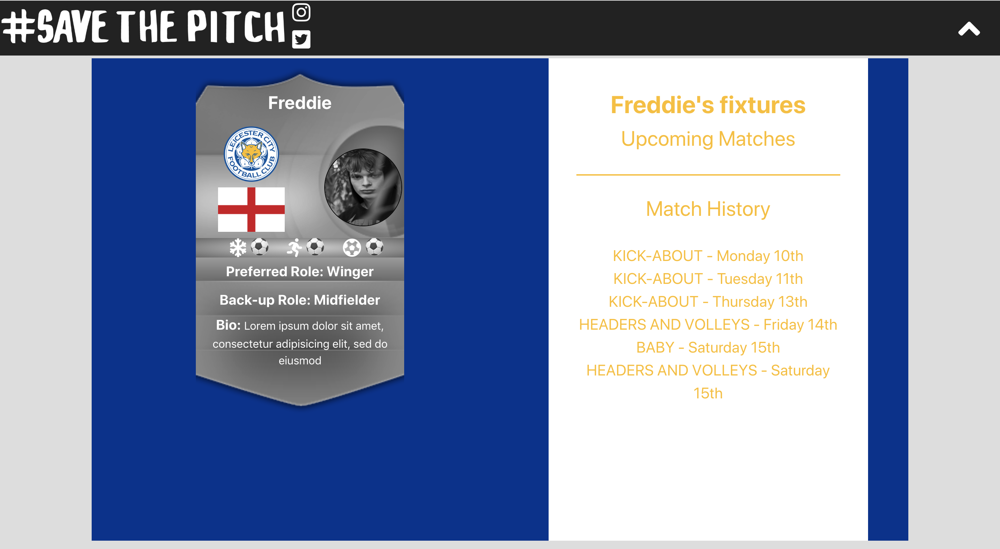

# General Assembly WDI Project 4: Save The Pitch

[GitHub](https://github.com/fwgbell/wdi-project-four)

[Heroku Link](https://save-the-pitch.herokuapp.com/)

The aim with Save the Pitch was to create an app that would get young people away from their screens and out onto the pitches, playgrounds and cages of inner city London. At their best, these shrines to the beautiful game are electric with energy, passion and fun; players learn and grow and lifelong friendships are made. At their worst, they are underused, fall into disrepair, and become car parks, building sites and dumping grounds. They can seem threatening, where disenfranchised youth go to hang out and cause mischief. It doesn’t have to be this way – Through mapping and photographing these pitches I aimed to open them up to new players and make them inviting, attractive and accessible. I hoped to show parents that they are safe and good for their kids and use technology to get people out there to join games and kick-abouts. The application was made using an Express back-end and React front-end using several node modules such as leaflet and moment, to make the most of mapping and timings respectively. This was the first time I’d worked with maps and distances on a project and it was a really difficult challenge to begin with but I’m pleased with how I was able to implement them in the end and I think they really add a lot of utility to the app. The part I’m most proud of is the messaging section of the app. Being able to message your friends in real-time back and forth made the app feel more real.


___

## Screenshot Walk-through

### Home page


### The pitch index page. This can be sorted by closest to you, average review rating or next to have an event taking place.


### This map page can be used to see near pitches to your current location


### Find page. This is the page for finding players to connect with and message.


### This is a user's profile page. It displays their information and upcoming fixtures. The background is and colour scheme is determined by the club the user supports.



### Messaging page. This page is where users can message back and forth to arrange or discuss pitches and matches


### This is how the messaging page looks on mobile


---

## Brief

I had to:

* **Render a grid-based game in the browser**
* **Switch turns** between two players
* **Design logic for winning** & **visually display which player won**
* **Include separate HTML / CSS / JavaScript files**
* Use **Javascript or jQuery** for **DOM manipulation**
* Use **semantic markup** for HTML and CSS (adhere to best practices)

---

## Technologies Used:

* Node.js
* EJS
* Express.js
* CSS3 with animation
* Javascript (ECMAScript6)
* Git
* GitHub
* Google Fonts


___

## Approach Taken

### Functionality

To begin the project I started work on my grid. I created a for loop that would use jQuery to create hundreds of numbered divs on my page and then it "cut out" the middle section I wanted to use. This gave me the grid size i wanted with each square having its own identifier number within it and meant that numbers at the edge of the grid weren't consecutive with numbers on the opposite side. This was intentional to stop movement over the edge of my map.

I then used objects to store the stats and location of my characters and worked on functions to handle their movement and attacks using the identifier numbers of my grid. All of this is controlled with the mouse and any changes that take place change the data in each characters object.

#### Featured piece of code 1

This piece of code generates the grid and numbers the squares accordingly. The large if statement selects the grid squares I wanted to keep for my game board. Further in my code all of the 'not-enterable' divs are removed from the page.

``` JavaScript
for(let i = 1; i < 600 ; i++){
  const $newDiv = $('<div></div>').addClass('not-enterable');
  $container.append($newDiv);
  if (i > 125 && i < 145 || i > 155 && i < 174 || i > 185 && i < 204 || i > 215 && i < 234
    || i > 245 && i < 264 || i > 275 && i < 294 || i > 305 && i < 324 || i > 335 && i < 354
    || i > 365 && i < 384 || i > 395 && i < 414 || i > 425 && i < 444 || i > 455 && i < 474){
    $newDiv.attr('class', 'grid-square');
    $newDiv.html(i);
  }
  if(i < 154 || i > 445){
    $newDiv.attr('class', 'not-enterable');
    $newDiv.html('');
  }
}
```
### MVP

This is a screenshot of when I felt I had reached my minimum viable product as my game now met every requirement of the brief.


### Styling

At this point in production I had only done minimal styling and had mainly focused on the logic to make sure my game ran. Next I focused on styling the game to make it more visually appealing to the user and to give more feedback on their interactions.


#### Featured piece of code 2

``` CSS
bit of css{
  which-is: good;
}

```

### Adding new features

blablabla about more variety in gameplay

___

## Wins and Blockers

blablabla


___

## Future Features

blablabla

* bla
* bla
* bla
